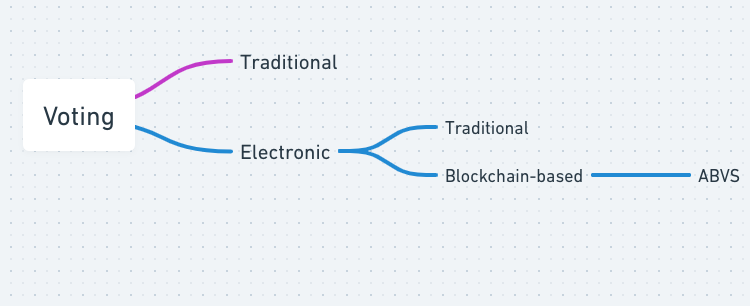
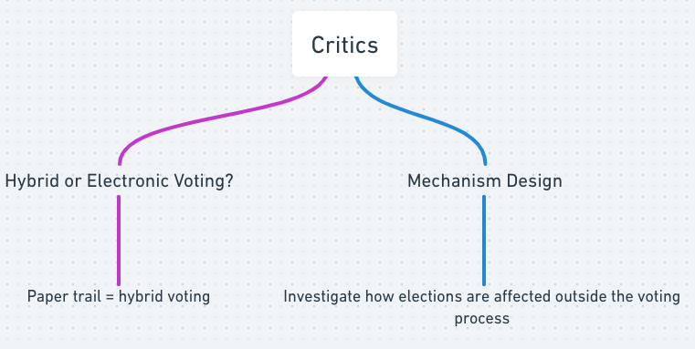
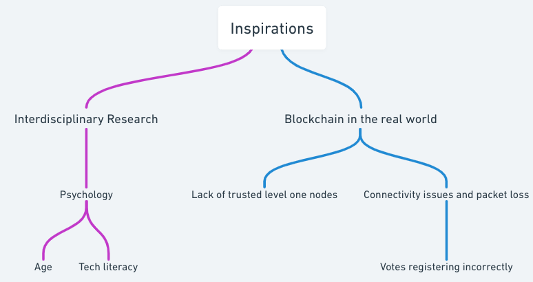

# The Future of Computional Microeconomics: Comments for "[Voting Process with Blockchain Technology: Auditable Blockchain Voting System](https://link.springer.com/chapter/10.1007/978-3-319-98557-2_21)"

> *Disclaimer: Submissions to the Final Project for [COMPSCI/ECON 206 Computational Microeconomics](https://ce.pubpub.org/), 2022 Spring Term (Seven Week - Second) instructed by [Prof. Luyao Zhang](http://scholars.duke.edu/person/luyao.zhang) at Duke Kunshan University.*

## Citation of the Article 

Pawlak, Michał, Jakub Guziur, and Aneta Poniszewska-Marańda. “Voting Process with Blockchain Technology: Auditable Blockchain Voting System.” *Advances in Intelligent Networking and Collaborative Systems*, 2018, 233–44. https://doi.org/10.1007/978-3-319-98557-2_21. 

in BibTex
```
 @article{pawlak_guziur_poniszewska-marańda_2018, title={Voting process with blockchain technology: Auditable blockchain voting system}, DOI={10.1007/978-3-319-98557-2_21}, journal={Advances in Intelligent Networking and Collaborative Systems}, author={Pawlak, Michał and Guziur, Jakub and Poniszewska-Marańda, Aneta}, year={2018}, pages={233–244}} 
```

## 

## Part I: Summary



**Fig.1 - Summary Mindmap** created by Whimsical

### 1. Background and Motivation

The blockchain is a shared and immutable ledger for recording transactions across a peer-to-peer network [(Leible et al. 2019)](https://www.frontiersin.org/articles/10.3389/fbloc.2019.00016/full). There are several applications for blockchain technology, most famously in cryptocurrencies. As of late, there has been an increasing amount of research devoted to implementing blockchain to improve the process of electronic voting (e-voting).

Voting is a crucial pillar of democracy. Modern voting is slow because of the centralization of the vote-counting process and unverifiable because voters cannot confirm that their vote had been properly counted. E-voting offers a promising alternative that can amend these issues. Nonetheless, e-voting still faces problems such as authentication, privacy, and data integrity [(Pawlak et al. 2018)](https://link.springer.com/chapter/10.1007/978-3-319-98557-2_21).

Thankfully, the blockchain can further mitigate these problems as it offers the ability to publicly verify the data stored inside. This effectively makes the auditing of voting information by voters possible.
The existing blockchain-based voting systems offer great advantages in security, anonymity, and verifiable voting. However, these systems delegate voter identification and authentication to human agents. This diminishes the benefits of remote voting and leaves voters vulnerable to impersonation [(Pawlak et al. 2018)](https://link.springer.com/chapter/10.1007/978-3-319-98557-2_21).

This paper presents a blockchain-based e-voting system that provides voters with the ability to verify their votes.

### 2. Research Questions

How to implement a blockchain-based voting system that provides voters with the
ability to follow and verify their votes and that offers voting results verification?

### 3. Methods

The research paper outlines the *Auditable Blockchain Voting System* (ABVS). The system offers the same benefits as conventional blockchain-based voting systems, namely security and anonymity. However, the system specifically focuses on enhancing the voter verification process. It does this through three processes, which are defined as follows according to [(Pawlak et al. 2018)](https://link.springer.com/chapter/10.1007/978-3-319-98557-2_21):

* Network of trusted nodes and polling stations
>Network of trusted nodes and polling stations is made of two parts. The first one consists of a trusted super-node representing national electoral central authorities (National Electoral Commission for Poland) and pre-selected and verified public institutions (e.g. universities). All of the nodes will act as providers of computing power and storage space for the ABVS blockchain system. Furthermore, they will be responsible for verification of the transaction and of the whole blockchain, with the super-node taking precedence. The second part is composed of the polling stations understood as the ABVS software and hardware associated with the actual locations of the polling stations. The voters use them to cast their votes, which will be broadcasted to the nodes for verification and processing in accordance with the blockchain paradigm.

* Vote Identification Tokens
>Vote Identification Tokes (VITs) are alphanumeric codes which are used as means of authentication and authorization of the voters within the system. In addition, the VITs enable vote following and identification during and after the election. They can be stored on scratch cards, paper sheets in envelopes or any other means that allows random selection by the voters without revealing their contents in advance. The VITs are created in the first stage of the election and are assigned and distributed among the polling stations. A database pairing VITs with polling stations is maintained in the trusted nodes.
* Voter-verified paper audit trail
>Voter-verified paper audit trail (VVPAT) is a paper ballot containing the same information as a single block in the ABVS blockchain. The VVPATs are printed by printers in voting booths after the voters cast their e-votes. The paper ballots are disposed by the voters into traditional ballot boxes before leaving the polling stations. This method provides additional audit and verification capabilities to the whole system. ABVS assumes that the VVPATs take precedence over the blockchain contents in case of inconsistencies.
* Voter error identification module
> Vote error notification module is a dedicated application for error notifications. The voters who find inconsistencies with their votes can anonymously notify the election officials by providing their VITs and error explanation. Complaints with valid VITs are processed further, which results in comparison of the corresponding blocks from the ABVS blockchain with the analogous VVPATs.

The three tools achieve the goal of effective vote verification in the following manner. Every voter can input their Vote Identification Token into the blockchain to double-check if their vote was counted properly. If it was not counted properly, the voter consults their voter-verified paper audit trail. If the discrepancy persists, they refer the issue to the voter error identification module which looks into the differences between the paper trail and the blockchain results and resolves the difference by deferring to the voter-verified paper audit trail as the correct value. All of this information is stored on a secure network of trusted nodes and polling stations. The two-level system assures that both decentralization and security are maintained, as not every node should be allowed to make edits to the blockchain in the case of voting.


### 4. Intellectual Merits

As the introduction outlines, even though e-voting is an improvement on regular voting, it still suffers from issues in voter identification and verification as both of these processes are still delegated to human agents. ABVS eliminates this issue through the innovative use of Voter Identification Tokens and voter-verified paper trails. In fact, after analyzing [Abuidris et al. 2019](https://dl.acm.org/doi/abs/10.1145/3376044.3376060) and [Xiao et al. 2019](https://link.springer.com/chapter/10.1007/978-3-030-29035-1_54), two SoKs, it is clear that ABVS is a unique blockchain-based voting system as none of the papers in either survey uses such a combination to systematically tackle the issue of voter identification.

Additionally, the use of the two-level network of nodes in the blockchain is another innovative feature of ABVS. The aforementioned SoKs also do not include papers that use the same hierarchical network architecture. ABVS, through this feature, manages to both preserve decentralization and also maintain security.

### 5. Practical Impacts

The practical impacts of this paper are quite clear. The ABVS is an e-voting system that circumvents all of the current liabilities of e-voting systems while maintaining all of its positives. This will allow the process of voting to become much more smooth, secure, and transparent. In fact, ABVS is a true and tested system. It has been used in elections in Poland and the writers confirm that its functioning has been verified as capable of real-world impact [(Pawlak et al. 2018)](https://link.springer.com/chapter/10.1007/978-3-319-98557-2_21).

## Part II: Critics 



**Fig.2 - Critics Mindmap** created by Whimsical

### 1. Economics for Computer Science: Incentives in Computer Science

From a Computer Science perspective, this paper is not quite revolutionary. Essentially, instead of finding a computational manner of verifying votes, the authors attempt to solve the issue by reverting to a paper trail. As such, we end up with a system that, even though, is secure, is still not fully electronic. In fact, I argue that the ABVS system should not be considered electronic voting but rather a hybrid voting. Since the system cannot achieve its goal of voter verification without a paper trail, ABVS should be considered a hybrid voting system. If the paper trail were to be removed, then discrepancies between the blockchain and the voter’s choice could not be resolved. Therefore, if the system becomes fully electronic by ditching the paper trail, its main intellectual merit is no longer viable. For this reason, I believe that this paper, even though it provides us with a working model, is not rigorous from a Computer Science perspective in achieving its desired outcomes.

### 2. Computer Science for Economics: Practicality in Economics

From an economics standpoint, this paper offers a great case study in effective mechanism design. ABVS creates the necessary circumstances for a voting system that is guaranteed to secure a positive outcome. It is quite clear that there are always several individuals or groups that would benefit greatly from rigging an election in their favor. ABVS created a transparent, decentralized, secure, and verifiable hybrid voting system that guarantees that process voting will produce a desirable outcome. The desirable outcome, in this case, is defined as counting the votes just as they were submitted by the voters.

It is important to note what happens before the process of voting: political campaigns and solicitation can also affect the process of voting. However, that goes beyond the scope of ABVS. Still, from an economics standpoint, it is important to design election laws that facilitate positive elections (e.g., not preying on people’s fear while campaigning, not taking foreign money).

## Part III: Inspirations




**Fig.1 - Inspirations Mindmap** created by Whimsical

### 1. Interdisciplinary Research

The potential application for interdisciplinary research would be psychology. Since electronic voting is not widespread as of yet, voters might feel that a purely electronic voting system might make it easier for bad actors to rig election results. It would be interesting to analyze from a psychological perspective the kinds of responses voters have towards a fully electronic voting system. Even though the paper trail is a useful mechanism to convince voters that their votes are safe, the use of cryptic terms such as blockchain might put off some tech-illiterate voters. An interesting investigation would be the change in response to this voting system by age. I would hypothesize that as voters are older, they are less inclined to trust such a voting system.

### 2. Research for Real-world Practices

From a real-world perspective, ABVS can be implemented in different environments to see how the different parts of the system would have to adapt according to the local situation. For example, the first layer of the network uses trusted institutions to register the blocks on the blockchain. However, what if we have a blockchain where such institutions are hard to come by? What could be a good alternative?

Additionally, we could look into how the effect of network connection and speed can impact the registering of votes on the blockchain. Perhaps the process of packet loss can result in the corruption of information.

### 3. Future Professional Growth

From a professional perspective, electronic voting is a field that will only continue to grow. It would be both lucrative and highly beneficial to society to create safe and secure electronic voting systems.


### References
Type here

### References in BibTex
```
```

